# How To Create a Game

This is the process for creating a game with this plugin. The instructions are explicit
and step-by-step but **basic knowledge of Unreal Engine is required**: how to navigate the
content windows, how to create a blueprint class based off another C++ class, how to navigate
the editor viewport window and so on.

1. First ensure you have a compatible version of Unreal Engine. As of now, the
   plugin is tested with **v5.6**
2. Then ensure the following plugins are installed in your Unreal account under Fab Library.
  * PaperZD
  * AdventureTools
3. Launch Unreal Engine 


## 1. Create a Game and Main Level

**Throughout, where you see "MyAdventure" replace with whatever your game is called**

### 1.1 Creating the Game

* From the welcome wizard or File > New Project choose "Blank" Game
    - Name it "MyAdventure" and choose "C++"
    - click "Create"

On creation you see a weird map - ignore it as we will create a blank level

### 1.2 Folder creation

* Right-click in Content Browser and choose "Create: New Folder"
  * Create each of these
    * `MyAdventure`  top levels folder, inside that create:
      * Blueprints
      * Data
      * Flipbooks
      * Hotspots
      * Materials
      * Meshes
      * Levels
      * StringTables
      * Textures
    * Inside textures create:
      * Environments
      * Items
      * MainCharacter
      * UserInterface

There's more folders that might be needed later, but this is a good start.

 
_In this screenshot the project name is **AdventureTemplate** replace that with yours, eg MyAdventure_

### 1.3 Create a new level

* File > New Level "MainLevel" 
  * Save it into your new folder `MyAdventure/Content/Levels`

## 2. Project Configuration / Setup

There's various settings and adjustments to do before starting work.

First make sure all the required plugins are enabled (blue tick):

* Edit > Plugins
  * AdventureTools
  * Paper2D
  * PaperZD


* Edit the Build file, eg `Source/MyAdventure/MyAdventure.Build.cs` for your game to include the modules:

```csharp
    PublicDependencyModuleNames.AddRange(new string[]
    {
        "Core", "CoreUObject", "Engine", "InputCore", "EnhancedInput"
    });

    PrivateDependencyModuleNames.AddRange(new string[]
    {
        "Paper2D", "PaperZD",  "Slate", "SlateCore", "AdventureTools"
    });
```

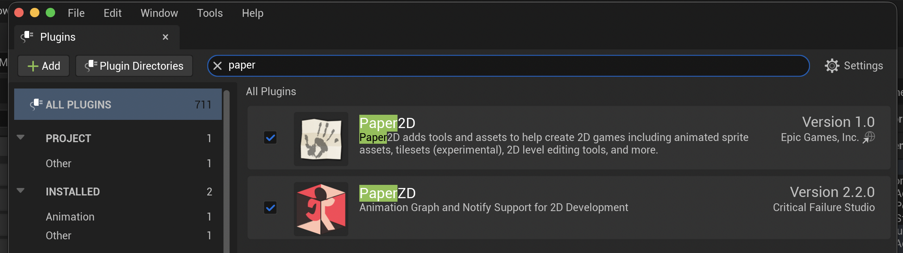

### 2.1 Project Maps and Descriptions

* Edit > Project Settings > Maps & Modes
    - Set "MainLevel" to be the Editor Startup map and Game Default map
* Add copyright notice and other info in the 
    - Edit > Project Settings > Project > Description

A restart of the editor is likely to be needed.

At this point try running the game and check it cleanly launches, and you get a nice black screen.

### 2.2 Setup for Pixel Art

Go to Edit > Project Settings. Search for and turn off the following settings:

* Motion blur off
* Auto exposure turn off
* Anti-aliasing off - for pixel art

* See this [Setup for 2D Guide] for more details.

[Setup for 2D Guide]: SetupFor2D/Setup.md

### 2.3 Paper2D setup

* Check Edit > Plugins
    - Check Paper2D is enabled and context menu in the content draw shows Paper2D items
* Edit `ProjectDir/Source/ProjName/ProjName.Build.cs`
    - Include `"Paper2D", "EnhancedInput"` in the array of `PublicDependencyModuleNames`

### 2.4 Import and sprite creation scale for small sprites

If you have very small sprites for your character (less than 15 pixels) may need to change scale

* Pixels-per-Unreal-unit - eg 0.5 (instead of 1.0)
  * Under Editor - Paper2D - Import
  * Effectively scales up the pixel art
  * Needed for movements systems
  * Needs to approximate human measurements

# 3. Import First Assets

Now its time to import the background texture for your main level, the first room in your game.


* _481px x 146px Tower_background.png from Lesser Dog's [Point and Click 2D Adventure Game tutorial]_

**The general approach you'll use for importing all your assets is:** 

* A) Drag graphics files from your Finder/Explorer into Unreal
  * Use the folder `MyAdventure/Textures/...` and drag the graphics (PNG files) in there
  * Organise them in **_subfolders_** as suggested below, or in a suitable folder heirarchy
  * I like to have an `Environments` folder for room backgrounds
  * Each PNG (or whatever format) you drag in will become a `Texture` asset
* B) Paper2D Settings 
  * Unreal will import your graphics automatically when you drag them into the folder
  - but we use **Paper2D** for our sprites, and that means **extra setup** on each import
  - right click and `Sprite Actions > Apply Paper2D Texture Settings` on your new asset
    - ensure the background changes to the checkerboard (alpha channel)
    - ensure textures are set to the `TranslucentUnlitSpriteMaterial` sprite material
      - if this doesn't appear then
        - click the ⚙️ settings cog wheel right of "Browse 🔍 Search Assets" box
        - check the box "Plugin Content"
* C) Create sprites or flipbooks
  * From each texture right-click and Sprite Action > Create Sprite
    - drag the resulting sprite into a new `/Sprites` folder
  * Select sequences of sprites to create Flipbooks from the sprites
    - save flipbooks into a `/Flipbooks` folder

_This guide will show the assets from Justin of Lesser Dog's tutorial, which are in the Content
folder of this plugin._

_Note: Use your own assets to ship any game you make - these assets are **not free**._

_They're included to allow you to follow along and to provide demo content that matches with Justin's [Point and Click 2D Adventure Game tutorial]._

[Point and Click 2D Adventure Game tutorial]: https://www.youtube.com/watch?v=sEy3c5JcLys&t=7s

If using plugin content they can be dragged in to your level directly from the plugin folder, or you can copy the assets
your games content folder first, then add them from there.

## 3.1 Add room background to the level

* Set the 3D viewport Camera Setting to "Perspective" and "Unlit"
* Click on the asset for your games room background, eg `TowerBackground_Sprite` 
  * You might need to filter the content browser for plug in content if using the ones mentioned above
  * Make sure its the **sprite**, and not the texture 
* Drag the sprite out and drop it into the 3D viewport
* Zero out the Location transforms so that it's X, Y and Z are as per the **Transform** screenshot
* Set the Rotation to x: -90, y: 0.0, z: 0.-90 as below
  * All sprite assets you add to your scenes will need to be set with this transform

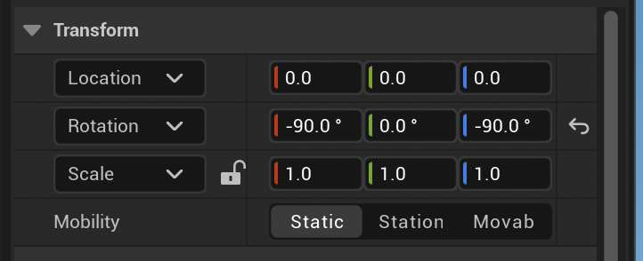

* Navigation shoult _not_ use the background `PaperSpriteActor` eg `TowerBackground_Sprite`
  * Unreal's navigation system does not understand an image - its all just coloured pixels
  * So the whole background has to be set to not affect navigation (covered below)
  * Set `Can Ever Affect Navigation` to _false_


* Although the background `PaperSpriteActor` that fills the whole scene does not affect navigation
  * We **_still_** want it to collide with the player character to prevent the character falling
  * **And** we want it to _not be visible_ to our probes that handle hover and click hits during play
* The current settings I am using for this are below:
  * `Collision presets: Invisible Wall`


If you look at the dimmed section that the _Invisible wall_ setting provides, it ignores all visibility
channel responses and still respects blocking responses for the pawn and other objects. 

**_Can't see your background image? Read on..._**

## 3.2 Understand Axes - Explainer

This is what the game will look like soon, after camera and other things are added. We are in
perpective view here. Look at the axes in the bottom corner.


_Unreal Engine viewport showing 3D camera looking at a 2D background_

To orient your Perspective view like this, mouse over to the _Outliner_ and select the Background 
image you just dropped in to the scene by clicking on it; then mouse back over to the 3D Viewport and
press "F" to focus on the background. Now (with your mouse still in the main
viewport) hold down _Alt_ and drag with the left mouse button down to orbit until you get something
like this view. 

**_You won't have a camera yet_ - but note the following things:**.

* Unreal Engine's **_"Top" view orthographic camera_** uses this view, with **_Y to the left and Z down_**.
* Since [UE 5.6 the axes changed] so we must rotate our 2D assets to x: -90, y: 0.0, z: 0.-90 
  * Unreal is Z up, and this is explained below
* This rotation is what we did for the background art of the tower
* It is a pain to re-orient the perspective viewport with "F" and the rest, right?

We can put our game camera in any position and orientation. So the game will _render_ the same, 
after the 5.6 changes. You'd think that would mean we would not have to do anything.

But the problem is we are forced to use **Top view** during development of our 2D game. There is no real choice here.

We _must_ use "Top" for our _game development_ and _that_ does not work unless we rotate our assets like this.

Setting it up as above means that we can _develop_ the game, and then we must also fix the camera so we have
it come out _looking and playing_ right as well.

Hopefully that explanation made sense and the `x: -90, y: 0.0, z: 0.-90` sprite rotation makes sense.
If not, bear with the process and see how it plays out after working with it for a while.

Anyone who has a better way of working, let me know.

### 3.2.1 Try Top View Now

1. Set the viewport camera settings to "Top"
2. We get axes rotated so Y is left and X is down.
3. Note the axes bottom left

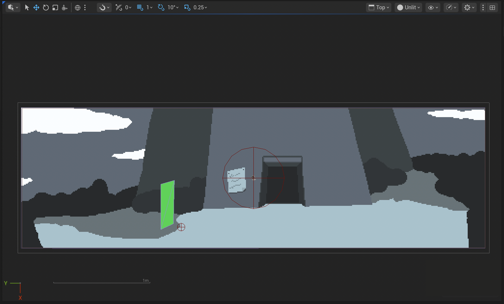
_Unreal editor top "Top" view with background art_

**Note:** Don't see the axes, bottom left? Check "Game" mode is off in the "Camera Options" menu

**_Why use "Top view"?_**

* The "Top" view avoids perspective distortion. 
  * To align the nav mesh and collision boxes we can see to line them up by using the top view. 
* Some tools like the Brush mode mesh painter do not work in perspective mode
  * And again we need to see to line up the mesh painter correctly
* If you tried the exercise above of "F" to focus and then orbit you'll see it was a pain
  * Top view is much easier to use.

Occasionally its useful to switch to perspective view, but most work will be in the top view.

**_Wait, what happened to the Z axis?_**

In top view, orthographic, the Z axis positive direction points _directly_ at you, out of the screen
towards the camera (as seen in the image at the top of this section). 

This Z axis is also the "up" direction in the Unreal Engine world, so "Top **_Down_**" obviously
means we are looking down on the scene from the top. In this picture in **Top** view we are looking
down onto the tip of the blue arrow.

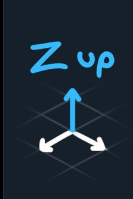

Its just that because our art shows a world with bushes and a tower, we think of a tower as
going "up". But in terms of Unreal the tower is stretching along the -X axis, not "up" along the Z.
So "up" can be confusing.

The important thing about "up" is that we still use gravity in the 2D game because its part of
the navigation system and moving our character. The character is spawned into the game at launch
and when going in to a room, and drifts down onto the navigation mesh then stops.

Here is another look at the Perspective viewport image at the top of this section to grasp this 
better. See the blue Z arrow sticking out of the scene toward the camera. And the red +X is 
pointing down to the "bottom" of the background artwork.


### 3.2.2 Grasp Handedness to Understand 2D setup

To quickly orient yourself to "Up" look at the brilliant diagram by [Freya Holmer] below:

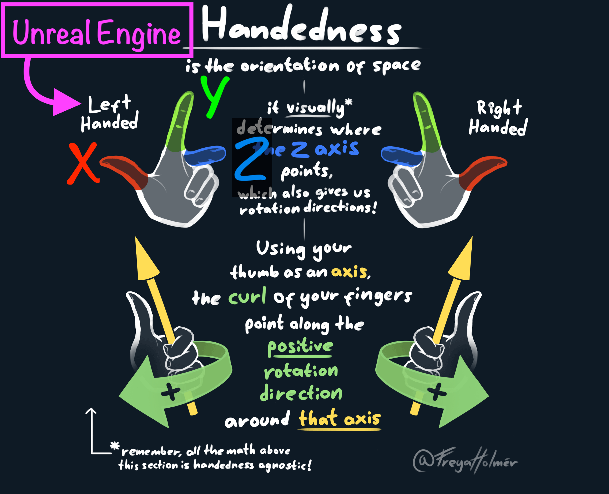
_Freya Holman's handedness infographic with annotations for Unreal Engine_

[Freya Holmer]: https://x.com/FreyaHolmer/status/1834989650236015036/photo/1

**_Which way is Z pointing? Into or out of the screen?_**

* The Unreal axes are a **left-hand** rule. Here's the way to answer where Z is:
  * Hold up your **_left_** hand as shown, as you sit in front of your computer monitor
    * Now point your **_index finger Y to your left_**
      * with your arm parallel to the monitor, 
    * Now rotate your wrist so **_your thumb X points down_**, 
    * With your middle finger bent in, 90 degrees to your index
      * notice that it is **pointing out of the screen**
  * Read off that your middle finger (Z axis) points toward you
    * so that is _what happened to the Z axis_, you're looking at it end on

Remember this for future work as we build up the game scene. These orientations become important
when stacking different layers of background art, furniture, trees and other items in the scene.

# 4.0 Add the Camera

The camera follows the player as they move around the scene, and is a custom camera that comes with
the AdventureTemplate. A blueprint will created off the `FollowCamera` class for this.

There's some setup that has to be done on the **_blueprint_**, so its ready to 
drop into every scene. Then, there are per-scene changes as well, to suit the size of the scene.

Finally to get the viewport working with the UI a `SplitScreenManager` class is needed.

Let's get to it.

## 4.1 Create the Camera Blueprint

* Right-click in the folder `MyAdventure/Blueprints` select "Blueprint Class"
  * Expand "All classes", search for `FollowCamera`
    * This is a C++ class in the AdventureTools plugin
    * Select, create it and name it `BP_FollowCamera`
  * Drag the new blueprint into the 3D viewport
  * Select it in the outliner:


_In the outliner select the BP_FollowCamera you added to the scene_

* With the camera selected in the outliner as above
  * Select the base `BP_FollowCamera` object in the details panel
  * Zero out the `Location` in the Transform for the top level camera object


* Double-click the `BP_FollowCamera` you created in the blueprints folder to open it
  * If you see "Open Full Blueprint Editor" click that to open the full editor

Note that there is already a pre-made `BP_FollowCamera` in the plugin folder that you can copy or use, but
its easy to make your own as above, and it might be handy if you want to customize it later.

## 4.2 Edit Camera Confines and _Confines of Camera_ ...?

Every scene has a different background size - it can be taller and wider than the camera aperture/field-of-view. So
the camera carries with it a box that constrains how far it can move, and this box must exactly contain the 
environment background. This means it has to change for every room you create, and be set to the background size.

_If the box has to change for every room, why bother to set up the box on the **blueprint**?_

I like to set up this box, the **Camera Confines** (an Unreal Engine collision box), so its easier to 
work with the the camera blueprint, in each scene. Its easier to be sure you have it lined up right if you do.

**Confines of Camera**

Very important: When Unreal sets up the scene, the `FollowCamera` reads the values out of the field called
`Confines of Camera` on the root `FollowCamera` object.


_Detail of the root of the FollowCamera blueprint showing the Confines of Camera property_

The code then _forces_ the actual `Camera Confines` collision box to those `Confines of Camera` dimensions. 
So in a sense its pointless setting these values, but again I find its a lot easier to setup the scene when 
you have this box correctly sized, to _match_ the `Confines of Camera` field.

* **In the 👉 Blueprint editor for the `BP_FollowCamera`** 
1. Select the root component `BP_FollowCamera (Self)` in the component tree, top-left
   * Edit the `Confines of Camera` property as above 
2. Select `Camera Confines` in the component tree, top-left
   * Locate the `Box Extent` under the Shape heading the Details panel
   * Set the Dimensions to 
     * `x: 1/2 height of texture`
     * `y: 1/2 width of texture`
     * `z: 10`
* So for a background that is 480px wide x 145px high, use `x: 72.5, y: 240, z: 10`

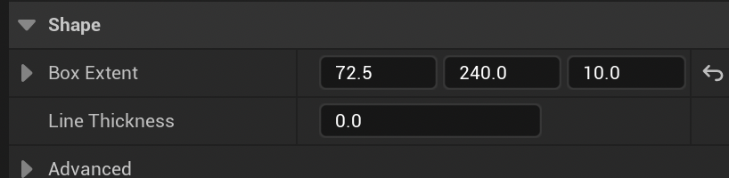

**_Why is X the width and Y the height? Seems back-to-front?_**

Again because of the rotated Unreal Engine Top Down viewport, we rotate everything so we can 
work in the orthographic top down view.

_Visualising the confines by making the box the same size as the `Confines of Camera` setting_

* As mentioned above these values set on the `Camera Confines` box are **overwritten at run-time**
  * Therefore, select the root Follow Camera 
  * Ensure the `Confines of Camera` are set to the same values

## 4.3 Edit Spring Arm values
  * Select the `Spring Arm Component` in the details for the blueprint
  * Set the rotations as shown below, y: -90, z: 180


  * Set the `Target Arm Length` to 200

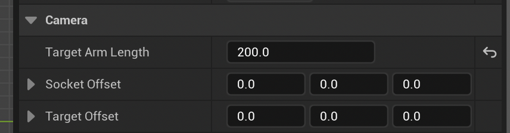

## 4.4 Camera Blueprint Configuration

These are the settings that are the same for every camera in the game. Set them on to
the blueprint so they'll be there for every scene.

* Double-click the `BP_FollowCamera` you created in the blueprints folder to open it
  * If you see "Open Full Blueprint Editor" click that to open the full editor
* Click on the **Camera Component**
* Ensure the following settings are correct:
  * _Camera Options_
    * Constrain aspect ratio [ ✔ ]
      * Note that the aspect ratio cannot be edited until you check this box.
  * _Camera Settings_
    * Projection Mode: _Orthographic_
    * Ortho width: _320_
    * Aspect ratio: _2.206897_
  * Transform scale: 0.1, 0.1, 0.1
    * This won't impact the game, but it makes the camera model in the scene less obtrusive

Regarding this magic number of `2.206897`, you get this by dividing the camera view width by
its height. The height comes from the game area height defined by the game UI. 

If you type in `320 / 145` into the `Aspect ratio` field and press enter Unreal will calculate
the value and enter it for you.

## 4.5 Check Camera Preview

* At this point you should be able to see your camera image previewed in the viewport
* Save and compile the `BP_FollowCamera` blueprint
* Close the blue print and return 

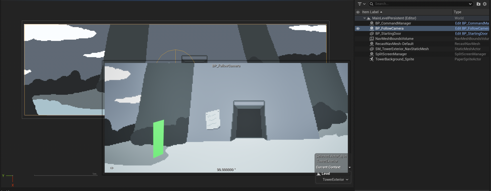

* check the camera preview is turned on to see the preview

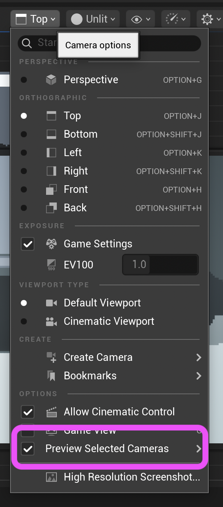

## 4.6 Check Camera Confines Setup

**_For each room that you create_** as mentioned you'll need to set the camera box extents.

Make a sticky note to do this each time you create a new room. You'll add a `BP_FollowCamera` and
then change these `Confines of Camera` to the values for that rooms background. You can
also set the size of the box as well, if you like.

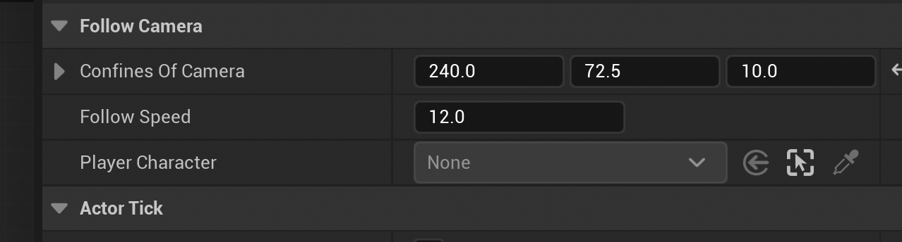

_At run-time these values are set forced onto the Camera Confines box._

* Click on the **Spring Arm Component**
    * Use Pawn Control Rotation - `[  ]` (unchecked)

See detailed instructions in [screen and camera setup how-to] for other screen sizes.

[screen and camera setup how-to]: ./ScreenAndCamera.md

## 4.5 Split Screen Manager

This C++ class was directly taken from Justin of Lesser Dog Tutorials, so all props to him for this. Its job
is to divide the screen into two halves so that the game view from the camera can occupy the top part, and the
UI with the class 9-button layout and the inventory can take up the lower part.

Setting this up is a 3 step process, involving migrating our game to use streaming levels. Although _some_ of
the last step is _optional_ and has to do with how you move items **_between the different levels_**. Book mark it
though as I find I need to do this one quite often while building a game.

### 4.5.1 Set up Streaming Levels

_**First** we have to set up streaming levels, so the split screen manager can live in the persistent level_

* Close all tabs except your main level editor window
* Open the Levels folder in the Content Pane
  * Right click on your level and rename it to match whatever the room is
  * In my example its an image of the outside of a tower. 
    * I rename my level to be `TowerExterior`
    * If you're using the art in the plugin you can follow along or choose your own
    * Don't worry about the warning, you will fix the references in step 3.
  * Right click in the Levels folder and choose _Level_ to create a new level
    * Name it `MainLevelPersistent`
    * Save your existing level: File > Save all
    * Double-click to open `MainLevelPersistent`
  * Ensure the Levels tab is open - Window > Levels
    * I situate the Levels tab under the Outliner
  * Drag the `TowerExterior` Level from the `Levels` content folder into the Levels tab
    * Drop it into the empty space below `PersistentLevel`
    * It should show up with `Add Level`
    * On drop it should appear as a sub-level under `PersistentLevel`
    * You should now see your game's background in the viewport just as before

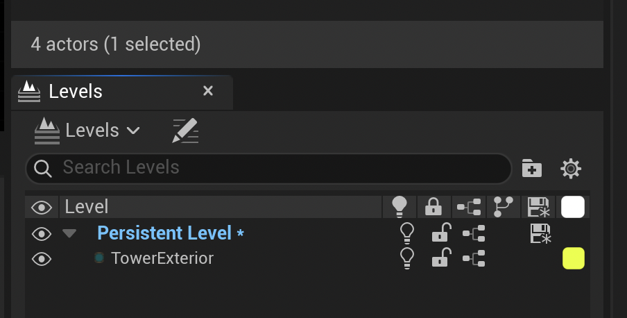

_Levels tab with TowerExterior added to our new top level_

### 4.5.2 Add the SplitScreenManager

_**Second** we have to add a `SplitScreenManager` to this new `MainLevelPersistent`_

* In the Content Browser select the `All` at the top level
  * In the search bar enter `SplitScreenManager`
  * This should locate the C++ class in the plugin, check the Module name is `AdventureTools`
  * In the Levels tab ensure the `PersistentLevel` is highlighted / selected in blue
    * In the main level viewport at the bottom right a dropdown should display 
      * Current Context: Level > MainLevelPersistent (Persistent)
  * Drag the SplitScreenManager instance into the scene and drop it anywhere
    * It should now appear in the Persistent Level
    * Toggle the 👁️‍🗨️ icon in the Levels tab next to TowerExterior
      * This will turn off the visibility of the TowerExterior level
      * You should see only the `SplitScreenManager` in the Outliner

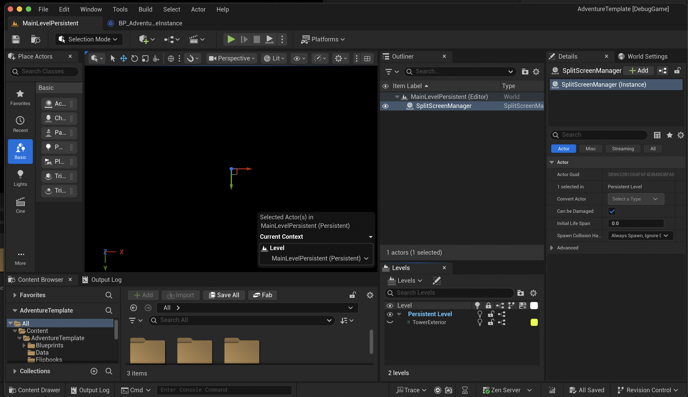

### 4.5.2 Configure and Manage the New Levels

_**Third** Configure & manage the new Levels._

* Edit > Project Settings > Maps and Modes
  * Editor Startup Map: MainLevelPersistent
  * Game Default Map: MainLevelPersistent

If the process above goes wrong, or at a later time you find you have scene items in the wrong level,
its important to know how to move that actor from one level to another.

Note that from now on, you will open and work with the new `MainLevelPersistent`. But if in error
you open up say `TowerExterior` directly and then run the PIE (Play in Editor) you will get bogus
results because the game is now designed to run with streaming levels, based on `MainLevelPersistent`.

Here is how to move an actor from one level to another. Make sure you have the destination level
selected and made current (highlighted in blue), and toggle on the eye icon for all levels in the
Levels tab. 

1. In the scene Outliner select the actor you want to move by clicking on it
2. Click on the destination level in the Levels window, and then right click on it
3. In the right-click (context) menu select _Move Selected Actors to Level_


_Moving an actor from one level to another_.

After the above steps click the save icon next to each level in the Levels tab/window. Then 
save the whole game via File > Save all.

# 5.0 Player Character Setup

For this you'll need a 2D character sprite with enough animations for your game. 
I used the [Point and Click Adventure Game Sprite Template] by DangerGoose which I paid `$12`
for on Itch.io. Its available on a "Name a price" offer, and I think its worth at least that.


[Point and Click Adventure Game Sprite Template]: https://danger-goose.itch.io/point-and-click-adventure-game-sprite-template

The idea is you could paint over the coloured sprites using them as a guide to create your own 
characters. For this demo I just used it as is. Here's gifs of what it looks like:

| Walking                         | Can't do it                    | Interacting                   |
|---------------------------------|--------------------------------|-------------------------------|
|  |  |   | 
| 45 pixels high | 23 pixels wide | 4 directions | 

The "temp guy" sprite sheet posted by Lesser Dog's Justin is also good, and allows you to work along
with his tutorial if you want to. **It doesn't have as many animations** however, and it also comes in 3 
movement directions only. So to get the 4 directions needed you'll have to duplicate the 6 frames of walking animations and flip them left
to right in a graphics program like Gimp. 

In Justin's tutorial he uses a simple Unreal scale trick to flip them 
in software which technically saves on storage compared with flipping them in a graphics program. 
But unfortunately **that does not work well with PaperZD**.

Also Justin gives some instructions on how to adjust the frames in the flipbook to get a nice walk
animation as (see below) its a bit jerky by default. Follow [Justin's excellent instruction] on how
to do this if you are using the tempguy.

[Justin's excellent instruction]: https://youtu.be/sEy3c5JcLys?si=4houMSoUDV0dUA-E&t=89

| Walking                               | Can't do it    | Interacting  |
|---------------------------------------|----------------|--------------|
| 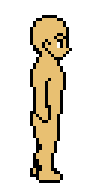 |  X             |  X           | 
| 57 pixels high                        | 28 pixels wide | 3 directions | 


## 5.1 Import Character Animations & Sprite Sheets 

* After applying Paper2D settings, right-click and extract sprites
  * Select the sprites needed and turn them into a flip book for
    * Walk left
    * Walk right
    * Walk back
    * Walk front
    * Idle front
* If using your own artwork create these flipbooks as needed
* Place the flipbooks into the flipbooks folder

## 5.2 Setup the Character Blueprint and Flipbook

* Inside the Blueprints folder create a `PlayerCharacter` folder
* Open that folder and right-click, create a blueprint based on the `AdventureCharacter` class
  * This is a C++ class in the template plugin, and it inherits from PaperZD
  * Name the blueprint class `BP_PlayerCharacter`
  * You can also copy the one out of the Plugin Content folder
    * Make sure **its a copy (not a move)**
* Double-click to open & edit the `BP_PlayerCharacter` class
  * If you see "Open Full Blueprint Editor" click that to open the full editor

### 5.2.1 Character Sprite setup

* Open the viewport tab in the blueprint editor
  * Click on the `Sprite (Sprite 0)` item in the Components tree on the left
  * In the details panel on the right set:
    * Sprite > Source Flipbook - your Idle front flipbook
    * Check that the material is `TranslucentUnlitSpriteMaterial`
      * Review 3. "Importing" above if you don't see this
    * Set the `Rendering > Tranlucency Sort Priority` to 5
      * This works like an "override" for Z sorting 
      * It will display **_on top of_** other objects (like our background)
      * This will only be available if the material is correctly set as above

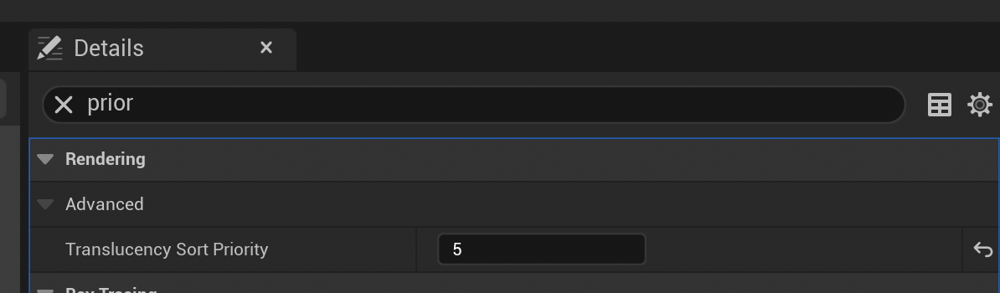

_Translucency Sort Priority_

* With the Sprite still selected set its transforms as below:

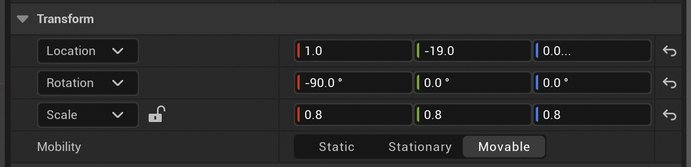
_Character sprite transforms_

* The `X: 90` is required as per all sprites to rotate it so we can see it in the game
* The `Y: -19.0` should be adjusted for your artwork, so that the sprite's feet are on the ground
  * The arrow and the capsule should be at the character's ankles
* The `Scale` values can be set if your sprite is a bit large for the scene. YMMV.

### 5.2.2 Capsule Configuration

_Resizing the height and width of the capsule_

  * Click on the "Capsule Component" (which is the root component of the character)
    * Change its radius to 4, and its height to 4.
    * It should become a small globe/circle
      * The reason for this is the navigation agent uses this to move the character in the scene
      * We don't want a big capsule as it will just cause the agent to get blocked


### 5.2.3 Speech Sphere Setup

_Character speech sphere setup_

* Click on the `Sphere` in the Component tree
  * Use the red & green transform arrows to move it just above the character's head
  * This object is used to position bark (speech) text in the game


_Character in the viewport of `BP_PlayerCharacter` after capsule, sphere and transform setup_

### 5.2.4 Character AI Setup

* In the `PlayerCharacter` folder right-click and create a Blueprint from `AdventureAIController` C++ class
  * Call it `BP_AdventureAIController`
* Navigate to and edit the `BP_AdventureCharacter` Blueprint
* Under the `Pawn` category ensure these settings are correct: 
  * Auto Possess player: Disabled
  * Auto Possess AI: Placed in World or Spawned
  * AI Controller Class: 

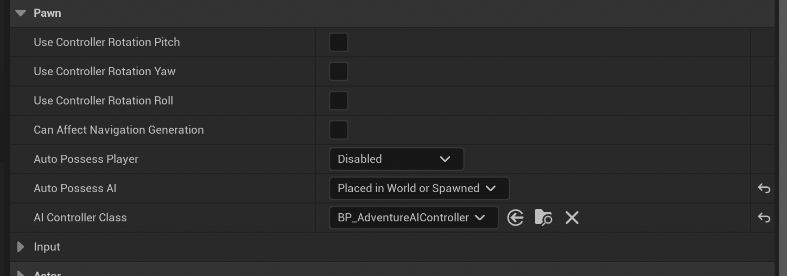

## 5.3 Character Controller and Modes

The way the Character is controlled for pathing around a level requires two separate pawn objects:

BP_PlayerCharacter          | BP_Puck
----------------------------| ------------------------------
Controlled by AI            | "Controlled" by player clicks
Visible in game             | Not visible in game
Default spawn character     | Programmatically created
`BP_AdventureAIController`  | `BP_AdventurePlayerController`

### 5.3.1 Puck

* Inside the `PlayerCharacter` folder right-click and create a blueprint sub-class of `Puck`
  * Name it `BP_Puck`
  * Double-click to open it and set the values in the `Inputs` section

_You can also copy the `BP_Puck` object already created in the plugin, but will still need to set up the inputs_


_These inputs and the context are defined inside the plugins contents_

  * The puck is responsible for sending the point and click UI operations to the game
  * Its seperate from the character because that is controlled by the nav AI
  * Under the **Pawn** section of `BP_Puck` ensure the settings are as in this screenshot


_Puck settings for AI and Possession_

  * `Auto Possess Player: Disabled` - that's the most important setting
  * Once set, compile and save

### 5.3.2 Player Controller

* Inside the `PlayerCharacter` folder right-click and create a blueprint sub-class of `AdventurePlayerController`
  * Name it `BP_AdventurePlayerController`
  * Double-click to open it
* Under the `Gameplay` section set _Puck class to spawn_ to `BP_Puck`

# 6.0 Gameplay Classes

We are nearly at a point where we can run the game. Not long now.

The next few classes are very simple, and mostly are just wiring together all the things we have
already created.

## 6.1 Game Mode

* Inside the `Blueprints` folder create a `Gameplay` folder

  * Right-click inside `Gameplay` and create a blueprint sub-class of `AdventureGameMode`
    * Name it `BP_AdventureGameMode`
    * Double-click and open it up and set the default pawn class and player controller class

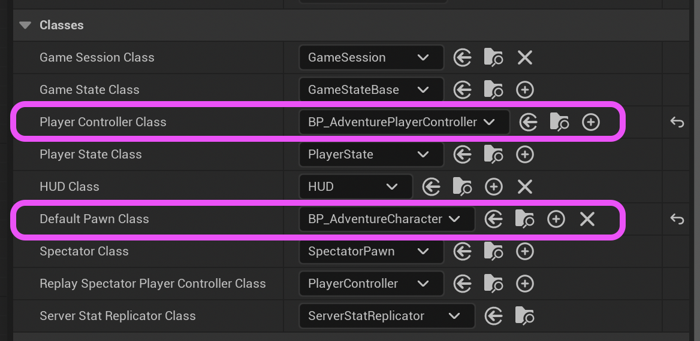

* Inside `Edit > Project Settings > Maps & Modes`:
  * Set `Default GameMode: BP_AdventureGameMode`

## 6.2 Command Manager

* Inside the `Gameplay` folder right-click and create a blueprint sub-class of `CommandManager`
  * Name it `BP_CommandManager`
  * Double-click to open it
* Set _Adventure HUD Class_ to `BP_AdventureGameHUD` (this is a UI class in the plugin)

## 6.3 Game Instance

* Inside the `Gameplay` folder right-click and create blueprint sub-class of `AdventureGameInstance`
  * Set the details panel up  as follows:
    * _Inventory Class_: `BP_ItemList`
    * _Starting Level Name_: `TowerExterior` (or whatever you named your level in 4.5.1 above)
    * _Starting Door Label_: `A1` (we still have to create this door)
    * _Save Game Class_: `BP_AdventureSave`
* Go to _Edit > Project Settings_ and then _Project > Maps and Modes_ 
  * At the bottom set _Game Instance Class_: `BP_AdventureSave`

# 7.0 First Door

Here we create about the last piece required to run the game: a door for the player to start at.
For now, follow along and use the pre-made components and the way to create your own will be
covered later.

## 7.1 Create the Door

* Right click inside the `Hotspots` folder you created in step 1.2
  * Create a blueprint subclass of _Door_ and called it `BP_StartingDoor`
  * Notice some of the other classes in the `HotSpot` class hierarchy


  * Set the _Door Label_ to `A1`
  * Set the _Current Level_ to `TowerExterior` (or whatever you named your level in 4.5.1 above)
  * Leave _Level to Load_ to `None`


## 7.2 Static Mesh 

* Click on the Static Mesh Component in the Component tree top left
  * Set _Static mesh_ to `SM_StartingDoor`
    * The materials should get set automatically
  * The way to create your own meshes for hotspots will be covered later
    * For now we'll just use this one from the plugin


## 7.3 Walk to Point

* Navigate in the Door blueprints viewport until the axes are Y down, X to the right
  * You should be able to visualise the mesh as door that will be in the scene (see below)
* Click on the _Walk to Point_ in the Component tree to highlight it in the viewport
  * Drag it so that its near the base of the mesh door, and out a bit
  * This is where the character will stand when they have just walked in through that door

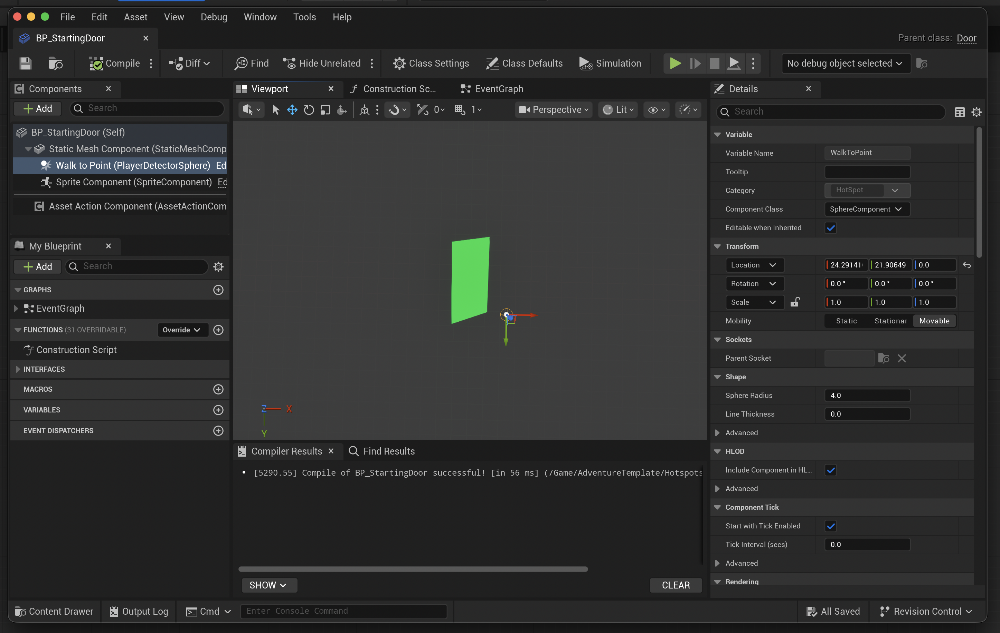
_Door walk to point is set up in front of the door_

## 7.4 Set up in the Scene

* Compile and save the new door
* Go back to the `MainLevelPersistent` tab 
  * Make sure the Levels tab is set to `TowerExterior` as current (blue)
* Drag the door into the scene and position it appropriately

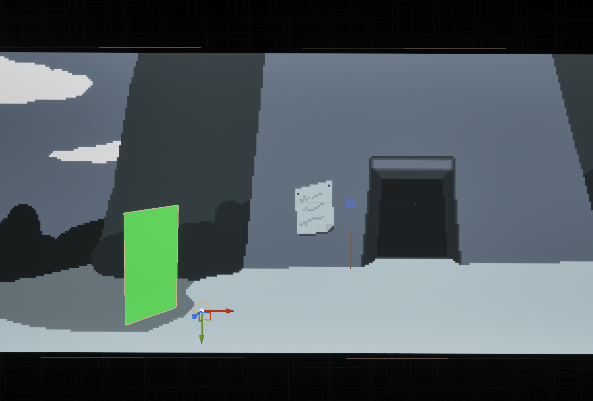

* You can fine tune the position of the _Walk to Point_
  * Either tune it inside the blue print
  * Or select the instance in the Outliner
    * and in the details select the Walk to Point
    * drag it to where you need it via the handles

## 7.4 Test Game Progress

* Run the game
  * The following things should work
    * The character should animate - the idle should be happening
    * You should be able to click in the scene and see debug information about the click
    * You chould be able to hover the mouse over the starting door and see text in the UI
      * Your description should show up here

# Next Steps

* [Create the Nav mesh]
* [Add Character Animation]
* [Add Hotspots]
* [Add Pickups]
* [Add Doors and Rooms]
* [Add NPCs and Conversation]
* [Script Additional Functionality]

[Create the Nav mesh]: ./CreatingNavMesh.md
[Add Character Animation]: ./AnimationStateMachine.md
[Add Hotspots]: ./CreatingHotSpots.md

---

[UE 5.6 the axes changed]: https://forums.unrealengine.com/t/the-top-view-axis-has-changed-in-version-5-6-what-was-the-reasoning-behind-this-change/2552694/7
[video on the Unreal site explains orbiting]: https://dev.epicgames.com/documentation/unreal-engine/viewport-controls-in-unreal-engine#orbiting-the-camera-around-an-object-or-pivot
