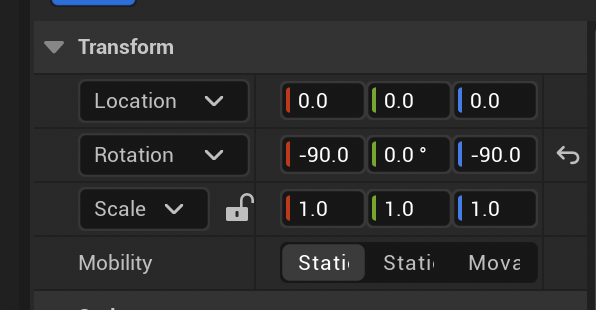
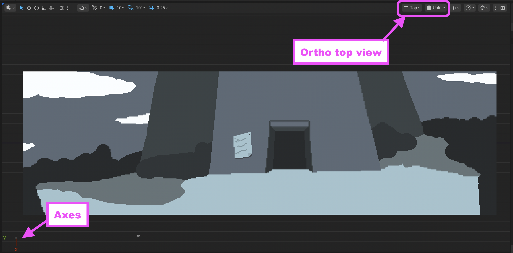
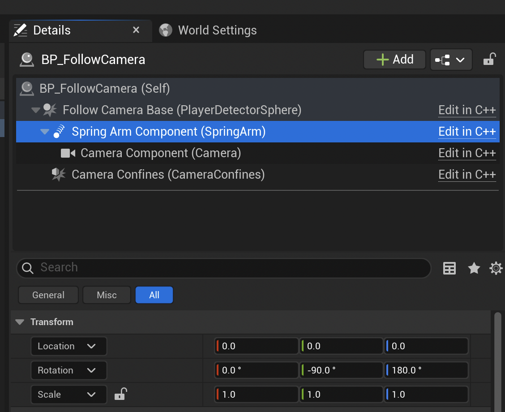
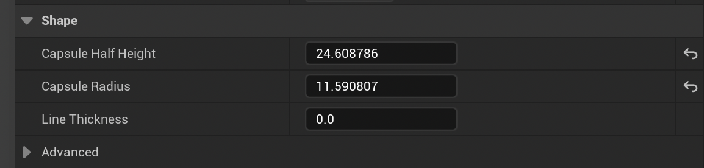
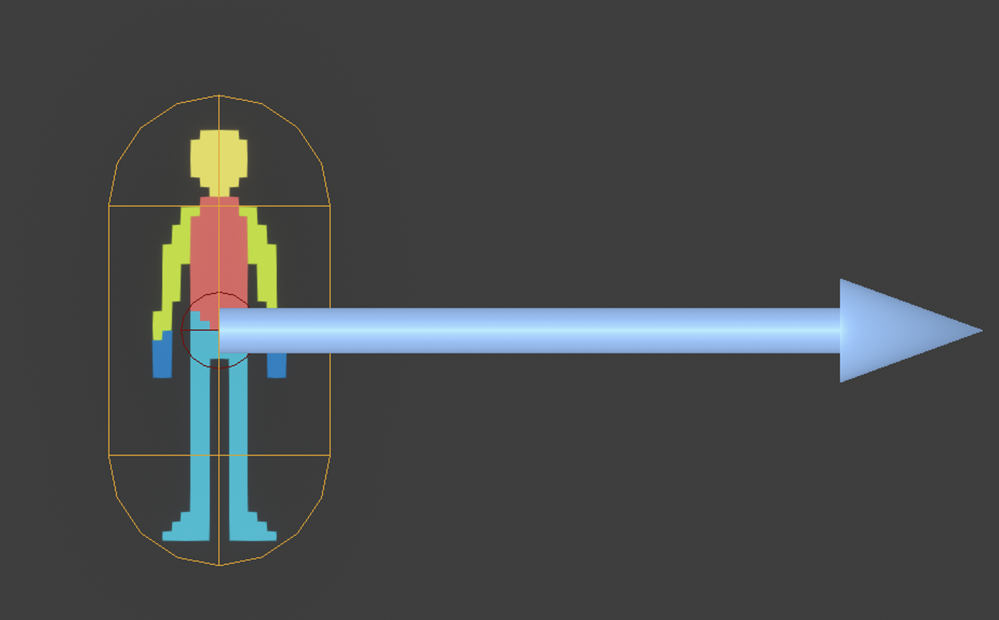

# How To

This is the process for creating a game with this plugin. The instructions are explicit
and step-by-step but **basic knowledge of Unreal Engine is required**: how to navigate the
content windows, how to create a blueprint class based off another C++ class, how to navigate
the editor viewport window and so on.

1. First ensure you have a compatible version of Unreal Engine. As of now, the
   plugin is tested with **v5.6**
2. Then ensure the following plugins are installed in your Unreal account under Fab Library.
  * PaperZD
  * AdventureTools
3. Launch Unreal Engine 


## 1. Create a Game and Main Level

**Throughout, where you see "MyAdventure" replace with whatever your game is called**

### 1.1 Creating the Game

* From the welcome wizard or File > New Project choose "Blank" Game
    - Name it "MyAdventure" and choose "C++"
    - click "Create"

On creation you see a weird map - ignore it as we will create a blank level

### 1.2 Folder creation

* Right-click in Content Browser and choose "Create: New Folder"
  * Create each of these
    * `MyAdventure`  top levels folder, inside that create:
      * Blueprints
      * Data
      * Flipbooks
      * Hotspots
      * Materials
      * Meshes
      * Levels
      * StringTables
      * Textures
    * Inside textures create:
      * Environments
      * Items
      * MainCharacter
      * UserInterface

There's more folders that might be needed later, but this is a good start.

 
_In this screenshot the project name is **AdventureTemplate** replace that with yours, eg MyAdventure_

### 1.3 Create a new level

* File > New Level "MainLevel" 
  * Save it into your new folder `MyAdventure/Content/Levels`

## 2. Project Configuration / Setup

There's various settings and adjustments to do before starting work.

First make sure all the required plugins are enabled (blue tick):

* Edit > Plugins
  * AdventureTools
  * Paper2D
  * PaperZD


* Edit the Build file, eg `Source/MyAdventure/MyAdventure.Build.cs` for your game to include the modules:

```csharp
    PublicDependencyModuleNames.AddRange(new string[]
    {
        "Core", "CoreUObject", "Engine", "InputCore", "EnhancedInput"
    });

    PrivateDependencyModuleNames.AddRange(new string[]
    {
        "Paper2D", "PaperZD",  "Slate", "SlateCore", "AdventureTools"
    });
```


### 2.1 Project Maps and Descriptions

* Edit > Project Settings > Maps & Modes
    - Set "MainLevel" to be the Editor Startup map and Game Default map
* Add copyright notice and other info in the 
    - Edit > Project Settings > Project > Description

A restart of the editor is likely to be needed.

At this point try running the game and check it cleanly launches, and you get a nice black screen.

### 2.2 Setup for Pixel Art

* Motion blur off
* Auto exposure turn off
* Anti-aliasing off - for pixel art

* See this [Setup for 2D Guide] for more details.

[Setup for 2D Guide]: SetupFor2D/Setup.md

### 2.3 Paper2D setup

* Check Edit > Plugins
    - Check Paper2D is enabled and context menu in the content draw shows Paper2D items
* Edit `ProjectDir/Source/ProjName/ProjName.Build.cs`
    - Include `"Paper2D", "EnhancedInput"` in the array of `PublicDependencyModuleNames`

### 2.4 Import and sprite creation scale for small sprites

If you have very small sprites for your character (less than 15 pixels) may need to change scale

* Pixels-per-Unreal-unit - eg 0.5 (instead of 1.0)
  * Under Editor - Paper2D - Import
  * Effectively scales up the pixel art
  * Needed for movements systems
  * Needs to approximate human measurements

# 3. Import First Assets

Now its time to import the background texture for your main level, the first room in your game.

The general approach for importing assets is: 

* Use the folder `MyAdventure/Textures/...` and put all the graphics (PNG files) in there
* Unreal will import them automatically but Paper2D requires some extra setup
  - right click and Sprite Actions > Apply Paper2D Texture Settings
    - ensure the background changes to the checkerboard
  - ensure textures are set to the `TranslucentUnlitSpriteMaterial` sprite material
    - if this doesn't appear then
      - click the ⚙️ settings cog wheel right of "Browse 🔍 Search Assets" box
      - check the box "Plugin Content"
* From each texture right-click and Sprite Action > Create Sprite
  - drag the resulting sprite into a new `Assets/Sprites` folder
* Select sequences of sprites to create Flipbooks from the sprites
  - save flipbooks into the flipbooks folder

_This guide will show the assets from Justin of Lesser Dog's tutorial, which are in the Content
folder of the plugin. Use your own assets to ship any game you make - these assets are **not free**._

_They're included to allow you to follow along and to provide demo content that matches with Justin's [Point and Click 2D Adventure Game tutorial]._

[Point and Click 2D Adventure Game tutorial]: https://www.youtube.com/watch?v=sEy3c5JcLys&t=7s

If using plugin content they can be dragged in to your level directly from the plugin folder, or you can copy the assets
your games content folder first, then add them from there.

## 3.1 Add room background to the level

* Set the 3D viewport view to "Top" and "Unlit"
* Click on the asset for your games room background, eg `TowerBackground_Sprite` 
  * You might need to filter the content browser for plug in content if using the ones mentioned above
  * Make sure its the sprite, and not the texture 
* Drag the image and drop it into the 3D viewport
* Zero out the transforms so that it's X, Y and Z are as per the **Transform** screenshot
* Set the rotations to x: -90, y: 0.0, z: -90 as below
  * Read the _Axes_ explainer as to why this is



## 3.2 Understand Axes

A word about Unreal Engine 2D Axes - these are confusing, and the "Top" view is counter-intuitive 
because it points the opposite of what you'd expect:

* Since [UE 5.6 the axes changed] so that when the viewport is set to "Top View"
* We have +Y to the left, and +X pointing down (see screenshot)



  * The options for dealing with the confusion is to:
    * Not use ortho camera
      * Use perspective and try to position the camera
      * bad, inconvenient, have to orient the perspective view often
    * Use top and ortho but set the sprites and camera to match
      * also bad, have to rotate sprites every time

My current approach is the latter, I set the view to "Top", and it means for every sprite you place in 
your scene you need to rotate them like this:


[UE 5.6 the axes changed]: https://forums.unrealengine.com/t/the-top-view-axis-has-changed-in-version-5-6-what-was-the-reasoning-behind-this-change/2552694/7

# 4.0 Add the Camera

* Right-click in the Blueprints folder and select "Blueprint Class"
  * Expand "All classes", search for `FollowCamera`
  * This is a C++ class in the AdventureTools plugin
  * Select, name it `BP_FollowCamera`
  * Drag the new blueprint into the 3D viewport


* Select the camera in the outliner as above
  * Zero out the translation in the Transform for the top level camera object
  * Set the Z translation to `10`


* Double-click the `BP_FollowCamera` you created in the blueprints folder to open it
  * If you see "Open Full Blueprint Editor" click that to open the full editor
  * Select the `Spring Arm Component` in the details for the blueprint
  * Set the rotations as shown below, y: -90, z: 180



* At this point you should be able to see your camera image previewed in the viewport
  * check the camera preview is turned on to see the preview
  * turn it off again to make the viewport less cluttered


## 4.1 Camera Confines Setup

**_For each room that you create_** you'll need to set the camera box extents. In your new
level, click the `BP_FollowCamera` in the outliner as per _3.3 Add the Camera_ above.

Make sure the top level `BP_FollowCamera (Self)` is selected in the details panel, then
edit the `Confines Of Camera` as per the screen shot. _NOT the Camera Confines object._


_At run-time these values are set on the Camera Confines object. Don't set them directly as they'll just be over-written._

These numbers are to suit the `TowerBackground_Sprite` but if using your own artwork, 
calculate these numbers as:

* `x: 1/2 width of texture`
* `y: 1/2 height of texture`
* `z: 10`

See detailed instructions in [screen and camera setup how-to] for other screen sizes.

[screen and camera setup how-to]: ./ScreenAndCamera.md

## 4.2 Camera Blueprint Configuration

These are the settings that are the same for every camera in the game, so set them on to
the blueprint so they'll be there for every scene.

* Double-click the `BP_FollowCamera` you created in the blueprints folder to open it
  * If you see "Open Full Blueprint Editor" click that to open the full editor
* Click on the **Camera Component**
* Ensure the following settings are correct:
  * _Camera Options_
    * Constrain aspect ratio [ ✔ ]
      * Note that the aspect ratio cannot be edited until you check this box.
  * _Camera Settings_
    * Projection Mode: _Orthographic_
    * Ortho width: _320_
    * Aspect ratio: _2.206897_
  * Transform scale: 0.1, 0.1, 0.1
    * This won't impact the game, but it makes the camera model in the scene less obtrusive

Regarding this magic number of `2.206897`, you get this by dividing the camera view width by
its height. The height comes from the game area height defined by the game UI. 

If you type in `320 / 145` into the field and press enter Unreal will calculate the above and enter it for you.

* Click on the **Spring Arm Component**
    * Use Pawn Control Rotation - `[  ]` (unchecked)

# 5.0 Player Character Setup

For this you'll need a 2D character sprite with enough animations for your game. 
I used the [Point and Click Adventure Game Sprite Template] by DangerGoose which I paid `$12`
for on Itch.io. Its available on a "Name a price" offer, and I think its worth at least that.

[Point and Click Adventure Game Sprite Template]: https://danger-goose.itch.io/point-and-click-adventure-game-sprite-template

Here's gifs of what it looks like:

| Walking                         | Can't do it                    | Interacting                   |
|---------------------------------|--------------------------------|-------------------------------|
|  |  |   | 
| 45 pixels high | 23 pixels wide | 4 directions | 

The "temp guy" sprite sheet posted by Lesser Dog's Justin is also good, and allows you to work along
with his tutorial if you want to. **It doesn't have as many animations** however, and it also comes in 3 
movement directions, so you'll need to duplicate the 6 frames of walking animations and flip them left
to right in a graphics program like Gimp. In Justin's tutorial he uses a simple Unreal scale trick to flip them 
in software which technically saves on storage, but unfortunately that does not work well with PaperZD.

Also Justin gives some instructions on how to adjust the frames in the flipbook to get a nice walk
animation as (see below) its a bit jerky by default. Follow [Justin's excellent instruction] on how
to do this if you are using the tempguy.

[Justin's excellent instruction]: https://youtu.be/sEy3c5JcLys?si=4houMSoUDV0dUA-E&t=89

| Walking                               | Can't do it    | Interacting  |
|---------------------------------------|----------------|--------------|
|  |  X             |  X           | 
| 57 pixels high                        | 28 pixels wide | 3 directions | 


## 5.1 Import Character Animations & Sprite Sheets 

* After applying Paper2D settings, right-click and extract sprites
  * Select the sprites needed and turn them into a flip book for
    * Walk left
    * Walk right
    * Walk back
    * Walk front
    * Idle front
* If using your own artwork create these flipbooks as needed
* Place the flipbooks into the flipbooks folder

## 5.2 Setup the Character Blueprint and Flipbook

* Inside the Blueprints folder create a `PlayerCharacter` folder
* Open that folder and right-click, create a blueprint based on the `AdventureCharacter` class
  * This is a C++ class in the template plugin, and it inherits from PaperZD
  * Name the blueprint class `BP_PlayerCharacter`
* Double-click to open & edit the `BP_PlayerCharacter` class
  * If you see "Open Full Blueprint Editor" click that to open the full editor
* Open the viewport tab in the blueprint editor
  * Click on the `Sprite (Sprite 0)` item in the Components tree on the left
  * In the details panel on the right set:
    * Sprite > Source Flipbook - your Idle front flipbook
    * Check that the material is `TranslucentUnlitSpriteMaterial`
      * Review 3. "Importing" above if you don't see this
    * Set the `Rendering > Tranlucency Sort Priority` to 5
      * This works like an "override" for Z sorting 
      * It will display **_on top of_** other objects (like our background)
      * This will only be available if the material is correctly set as above


_Resizing the height and width of the capsule_

  * Click on the "Capsule Component" (which is the root component of the character)
    * See above screenshot
    * Drag in the Shape > Capsule Half Height & Capsule Radius boxes to change its size



* Change the size until it neatly fits the character idle
  * You will likely need to move the `Sprite` by a pixel or two to get it centered
  * To do this make sure you have the grip snapping turned off in the viewport controls


_Character in the viewport of `BP_PlayerCharacter` after capsule sizing_

## 5.3