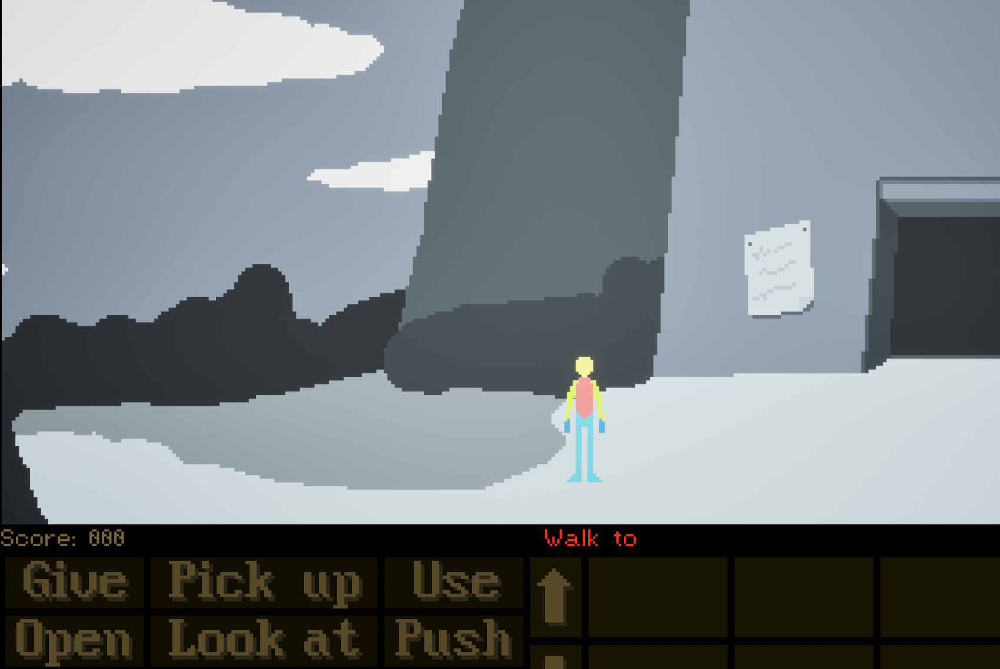
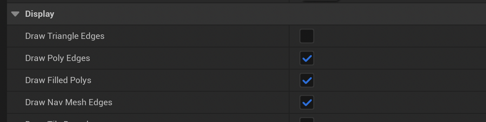
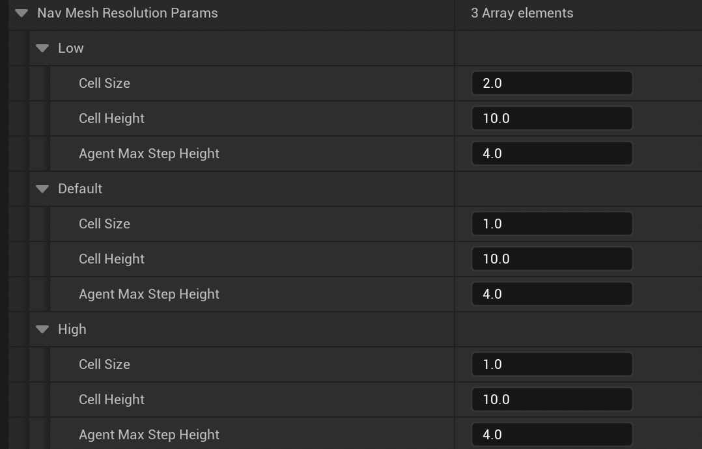
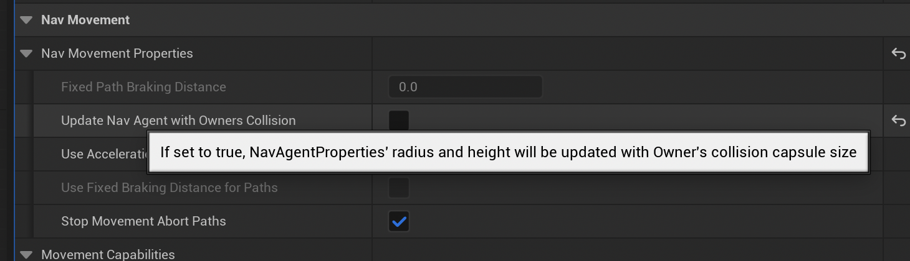

# Nav Mesh Agent Settings

Because this is a 2D Lucas Arts style game the background, the environment is a small image, 480px x 145px. Our character
is also very tiny. Because Unreal's nav system is designed for large open 3D worlds the default values have to be
turned way down.

_Backgrounds are small images compared to a 3D unreal game_

This means that our agent, the AI component of the character has to be small as well. The settings below
are very fiddly and also sensitive; if any of these are wrong the nav mesh either won't get created at 
all, or it won't work once the point-and-click movement is invoked.

# 1. Setup Project Settings for Agents

**_Project Settings... > Engine > Navigation System_**

We create a default agent in the Project settings with a radius in the top down view of 1 unit.

* Click the menu Edit > Project Settings...
* Go to `Engine > Navigation System`
* Expand the Supported Agents section at the bottom
  * Click the `+` to add a new agent
  * Name it `Default`
  * Confirm that the Color and Default Query Extent match this screenshot

Most of these settings won't need changing but check these ones carefully:

* `Nav Agent Radius: 1.0`
* `Nav Agent Height: 10.0`

Use the new `Default` agent by setting it at the top of the `Navigation System` page:

* `Default Agent Name: Default` - this must match what you called your agent above
* `Auto Create Navigation Data: [ ✔ ]`

# 2. Setup Project Settings for Mesh Generation

* **_Project Settings... > Engine > Navigation Mesh_**

These settings control how the navigation mesh is auto generated.

* This (above) is how I have mine setup, and it just controls how the nav mesh appears during level building
  * You can experiment with the other settings here if you like

## 2.1 Runtime Generation Settings

* Runtime > `Runtime Generation: Dynamic`

This makes the Bounds Volume Regenerate the navigation mesh in response to changes in the scene. This is
important. Checking `Force Rebuild on Load` also makes the nav mesh rebuild when the scene is loaded into memory. 

_If you know what you're doing_ you might be able to save load times on levels by setting Regeneration to static,
and removing the `Force rebuild`; and then making sure you create the nav mesh each time you modify 
something on the level.

## 2.2 Nav Mesh Resolution

These parameters control how coarse or fine the mesh cells are, and how accurate the result is. We need these
quite fine for small game scene sizes like 480px x 145px. For say 1080p or 1280p these could be coarser, say
double this size and give a performance boost.

## 2.3 Nav Mesh Generation Agent Settings

These look similar to the Section 1 (above) settings but be careful to avoid getting confused.

# 3 In Game Settings

Exit the Project Settings and return to the game Editor window. Locate the `BP_AdventureCharacter` and
double-click to open it.

* Set `Update Nav Agent with Owners Collision` to false

What this setting does is takes the collision capsule at the base of the player character and uses its
dimensions to update the AI agent. Generally we don't want that. It might work but we set the agent's
default size to 1 in the Project Settings and its best to control it there.

