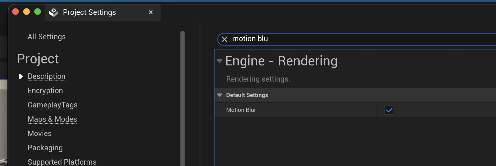
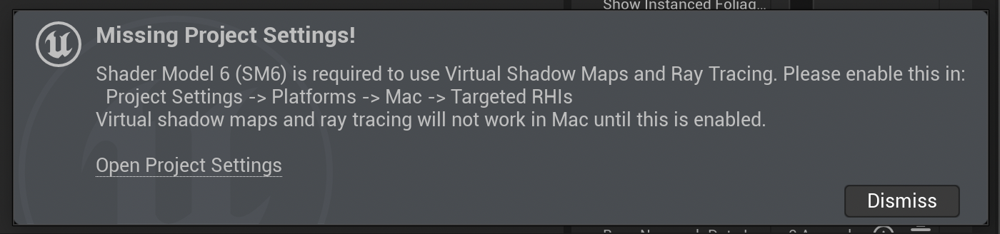
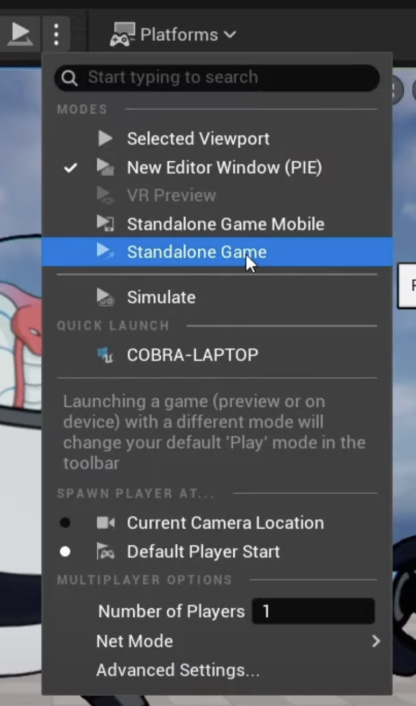
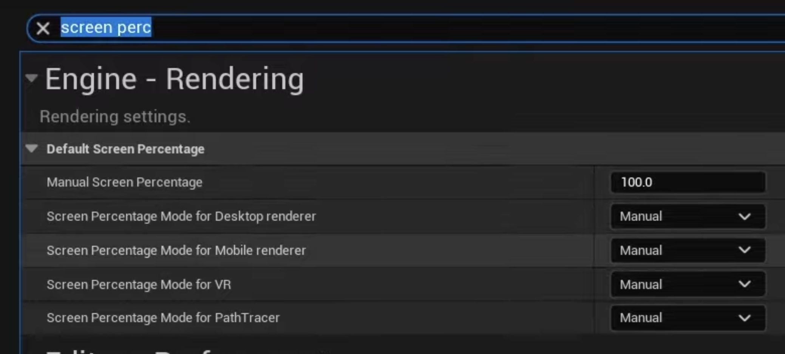
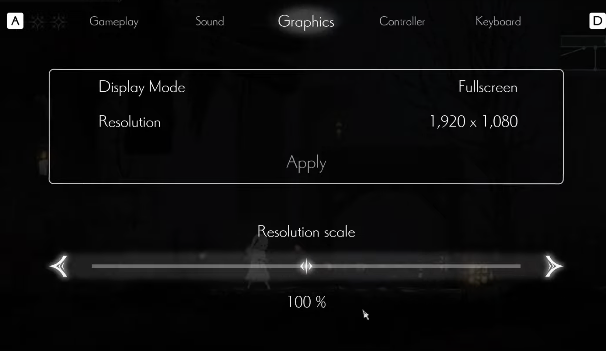
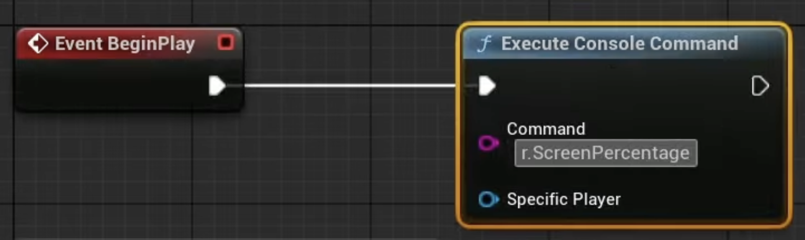
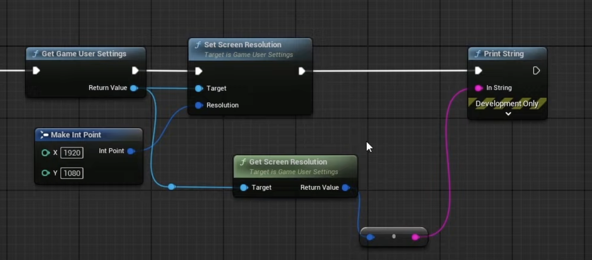
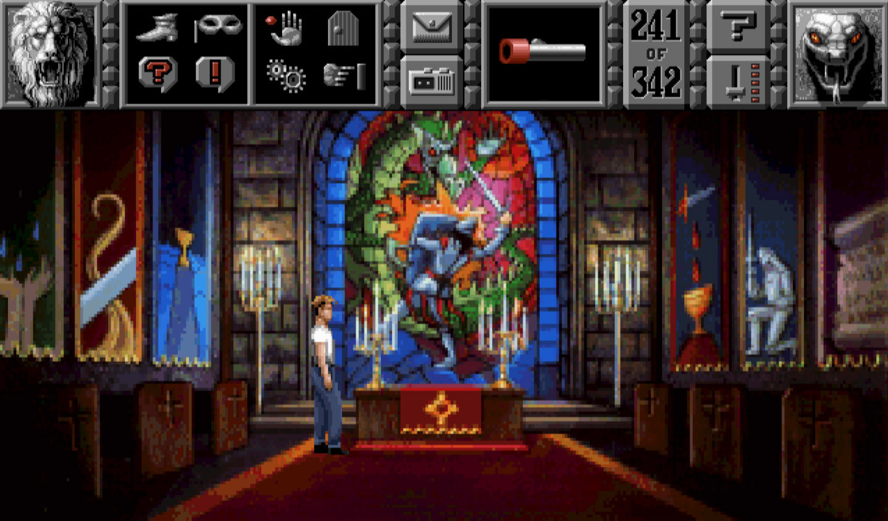
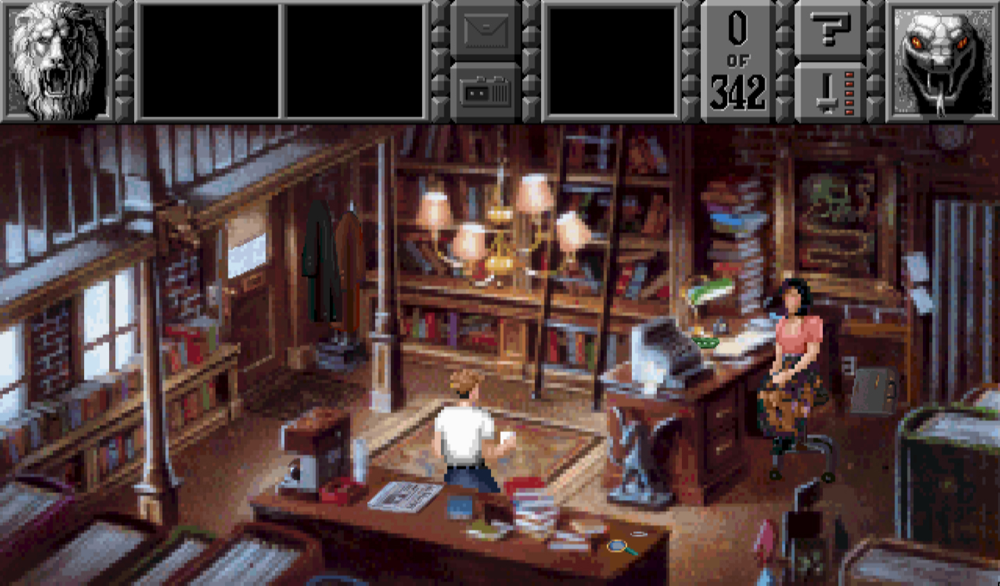

# Setup for 2D Games with Unreal

This plugin is for creating 2D Adventure Games in Unreal. It is basically a template, but uses a plugin
for most of the functionality. The steps in this document could apply to other games (not just point
and click adventures) and mostly come from experience with getting a good result for the games I made
with Unreal Engine 5. YMMV.

Some of this comes from an excellent YouTube video:

* [How to make High Resolution 2D Games in Unreal Engine 5]
  * by [Cobra Code]

Below is the setup for creating a 2D game with the following attributes:

* 2D sprite based animation
* Art is "hi-res"
  * might be quite small sprites, but its...
  * _not_ "pixel art"

# Settings in Project Settings

* Turn off auto-exposure
    * Designed to mimic the effect of going into harsh lighting - makes things look blown out

* Turn off motion blur
    * Also makes small art look bad

## Lumen Problems

* Fix blurring and ghosting - with bad outlines in art
    * Turn off Lumen - in settings "Dynamic global illumination" -> None

* Reflection method - screen space

* Shadow maps - change from "virtual" to "shadow maps"

Note that on some platforms having Lumen requires a lot of extra shaders to be compiled, or even a
whole new shader model. See the warning dialog below:

So as well as preventing blurry 2D art, turning off lumen should make our games smaller and 
require less shader compile time.

* Anti-aliasing - FXAA or NONE
    * Consider having an in game setting that allows switching

[How to make High Resolution 2D Games in Unreal Engine 5]: https://youtu.be/jsuBXckPvMw?si=FP4iyP5dX34j49qg 
[Cobra Code]: https://www.youtube.com/@CobraCode

# Testing 

When using the play-in-editor mode to test the game while developing it, avoid getting lulled into a 
impression of how the game will look.

* In the editor use "Standalone Game" to see the game at a better approximation of how it will look to players
  * Can play full screen by hitting `<alt> - <enter>`

* Image credit: [Cobra Code]

# Rendering

Because these assets are small we want to turn up the rendering and avoid scaling artefacts. Set the
scaling to 100% so its native screen size.

* Engine scalability
  * Set to Epic
* In a shipped game can include a setting to render at high resolution eg 4K textures - up to 200%
  * Is very expensive, so only for high end hardware

## Game and Screen Resolution

* Set the screen percentage aka the "resolution" to 100% or native.
  * Games can adjust the setting when not automatic:

* Image credit: [Cobra Code]

* Until the game menu is built we can do this in the under development game via
  * Create a new Game Mode - set in Maps & Modes
  * In the game mode's Begin Play execute `r.ScreenPercentage 150` - this is for the editor
  * Also want to set the resolution for the actual game

  * Get User Settings > Get Screen Resolution
    * Hacky way to set the resolution before implementing a settings menu

# Sprite Inspo for Adventure Games

A game that had a huge influence on me is [Gabriel Knight: Sins of the Fathers] by Jane Jensen
and Sierra-Online. The game has been re-released in 3D for modern machines, so please show the
folks who are the original creators of the IP referenced below some love and buy their new game
[Gabriel Knight: Sins of the Fathers 20th Anniversary Edition] on steam.

I'm sharing these images for illustration purposes only - they are owned & licensed by Sierra-Online and
Jane Jensen, they are _not_ freeware, and not for use in games without their approval.

In my games my character sprites are a lot smaller than the ones Cobra Code mentions as HD,
but my sprites are bigger than most so called "pixel art". For adventure games I think of the
8 way characters like Gabriel Knight. Here the sprite is 60 pixels high.

* Image credit: [The Spriters Resource] **not free**

...and a screen is 1438 x 845 pixels.

* Image credit: [Game Guide - French / Jane Jensen]

That game also had a lot of custom sprites for specific situations, such as holding a cup of coffee:

For a 16:9 game that is 1080p you have a screen that is 

* 1080p screen 
  * 16:9 - 1920w x 1080h - Gabriel is 75 pixels high

[The Spriters Resource]: https://www.spriters-resource.com/ms_dos/gabrielknightsinsofthefathers/asset/56478/
[Game Guide - French / Jane Jensen]: https://game-guide.fr/34538-gabriel-knight-sins-of-the-fathers/
[Gabriel Knight: Sins of the Fathers 20th Anniversary Edition]: https://store.steampowered.com/app/262000/Gabriel_Knight_Sins_of_the_Fathers_20th_Anniversary_Edition/
[Gabriel Knight: Sins of the Fathers]: https://en.wikipedia.org/wiki/Gabriel_Knight:_Sins_of_the_Fathers

# Textures

The tl;dr here is turn off texture streaming on assets, and also don't use huge assets.

See Cobra Code video:

* [How to make High Resolution 2D Games in Unreal Engine 5 - Texture Settings]

* 4k textures vs HD textures
  * 4k - eg cobra warrior
    * Makes a difference for players with 4k display and PC that will run it
  * HD - 1920 x 1080
    * Probably fine for most things especially if character is not close
* To change other settings including texture streaming
  * select all the sprites for easy editing
  * Content Drawer > Filter > Texture [ x ]
    * Can now use that filter any time
  * Select all - cmd-A
    * Right-click edit in property matrix
    * Never stream [x]

[How to make High Resolution 2D Games in Unreal Engine 5 - Texture Settings]: https://youtu.be/jsuBXckPvMw?si=wivYunXq1p671nQP&t=686